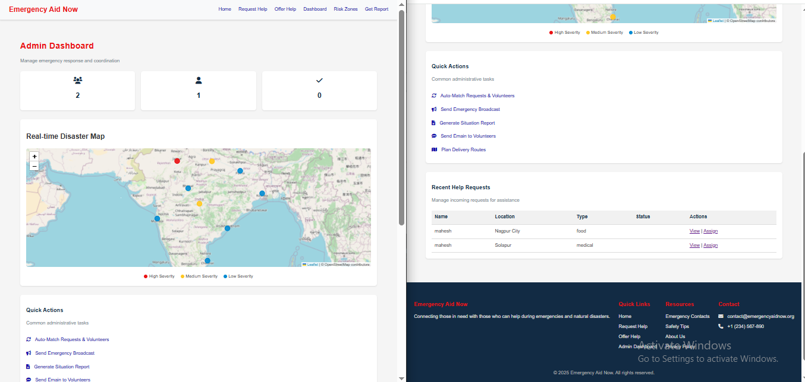
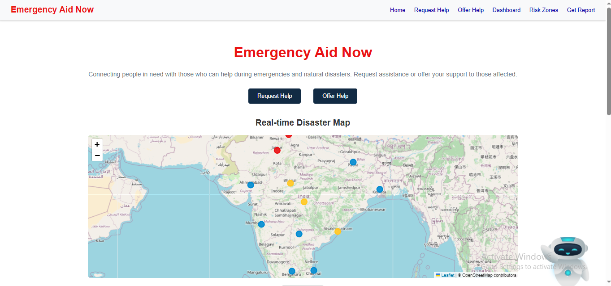
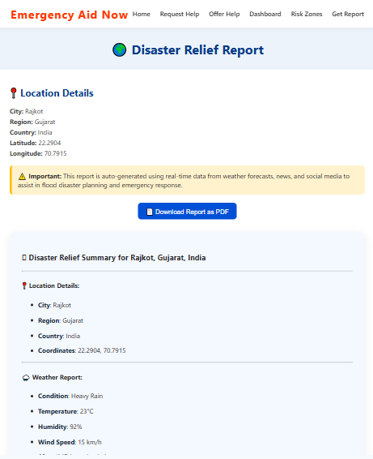
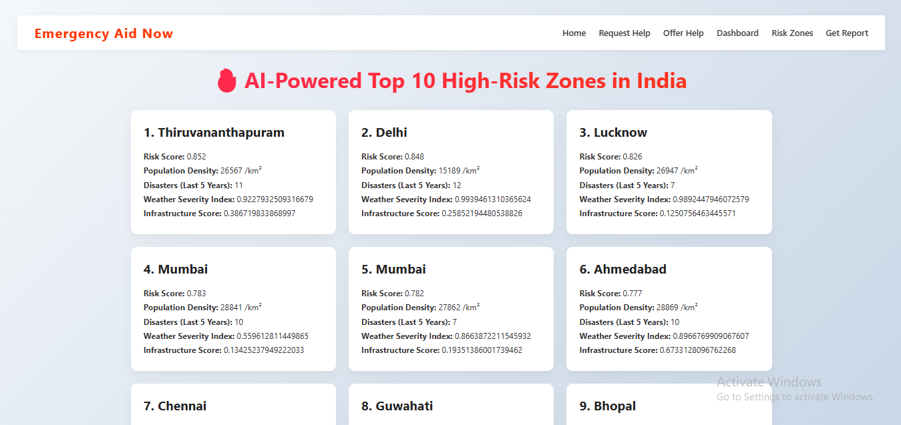
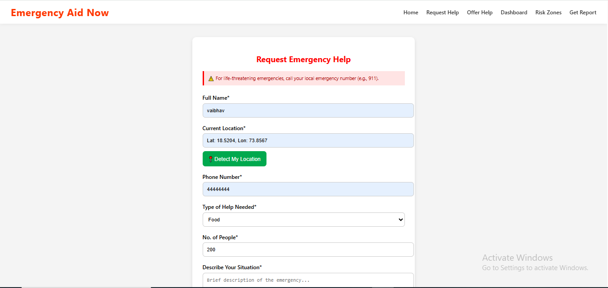
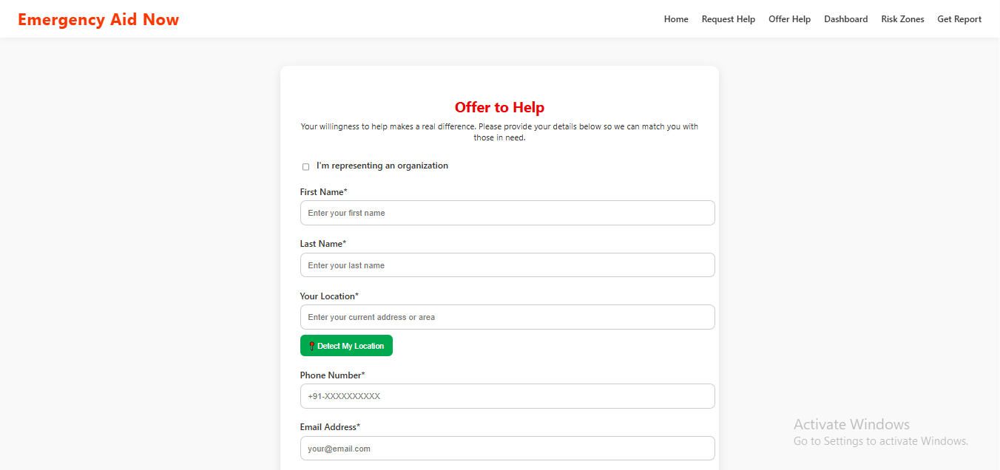

# 🚨 AI Disaster Relief System

> **An AI-powered platform for smart, real-time disaster management and emergency coordination.**  
> *Built for efficiency, speed, and reliability during critical times.*


---

## 📖 Overview

The **AI Disaster Relief System** is a comprehensive web-based platform designed to bridge the gap between disaster victims and relief providers. By leveraging **Google's Gemini AI**, the system analyzes disaster reports in real-time to assess severity, prioritize incidents, and suggest optimal resource allocation.

This project was developed for a hackathon organized by **Google Developer Student Clubs (GDSC)** at **MIT Alandi College**. It focuses on using free, accessible technology to solve critical real-world problems without the need for expensive paid APIs.

---

## ✨ Key Features

- **🤖 AI-Powered Analysis**: Utilizes Google Gemini API to analyze incoming disaster reports, categorize them by severity, and detect potential risks.
- **📍 Smart Risk Zone Detection**: Identifies high-risk zones based on reported data and historical patterns to alert nearby users.
- **🆘 Emergency Request System**: A streamlined interface for victims to request immediate help (food, medical, rescue).
- **🤝 Volunteer Coordination**: Allows individuals and organizations to offer help, matching them with innovative needs in real-time.
- **📊 Interactive Dashboard**: A central command center for administrators to view live reports, resource distribution, and active emergencies.
- **🌍 Location Intelligence**: Integrates mapping for visualizing disaster zones and relief camps (simulated/integrated).

---

## 🛠️ Tech Stack

This project is built using a robust and scalable MERN-based architecture:

- **Frontend**: HTML5, CSS3, JavaScript, EJS (Embedded JavaScript templates)
- **Backend**: Node.js, Express.js
- **Database**: MongoDB (Atlas or Local)
- **AI Integration**: Google Gemini API (Generative AI)
- **Tools**: Git, npm, VS Code

---

## � External APIs & Integrations

The system integrates multiple third-party APIs to enhance functionality and provide real-time data:

- **[Google Gemini API](https://ai.google.dev/)**: Used for AI-driven disaster analysis, risk assessment, and chat assistance.
- **[WeatherAPI](https://www.weatherapi.com/)**: Fetches real-time weather conditions for disaster-affected areas.
- **[OpenRouteService API](https://openrouteservice.org/)**: Provides routing and mapping data for logistics and "street map" visualization.
- **[Google News RSS](https://news.google.com/)**: Aggregates the latest disaster-related news based on location.
- **[IP-API](https://ip-api.com/)**: Automatically detects user location for quicker reporting.
- **[Twitter (X) API](https://developer.twitter.com/en/docs/twitter-api)**: Monitors social media for real-time disaster updates and sentiment.
- **Google Maps**: Used for navigation links and visualizing directions.

---

## �📸 Screenshots

| **Dashboard** | **Home Page** |
|:---:|:---:|
|  |  |

| **Disaster Reporting** | **Risk Zone Detection** |
|:---:|:---:|
|  |  |

| **Request Emergency Help** | **Offer Help** |
|:---:|:---:|
|  |  |

---

## 🚀 Getting Started

Follow these instructions to set up the project locally on your machine.

### Prerequisites
- Node.js installed (v14 or higher)
- MongoDB installed or a MongoDB Atlas connection string
- A Google Cloud Project with Gemini API access

### Installation

1. **Clone the repository**
   ```bash
   git clone https://github.com/your-username/ai-disaster-relief-system.git
   cd ai-disaster-relief-system
   ```

2. **Install dependencies**
   ```bash
   npm install
   ```

3. **Configure Environment Variables**
   Create a `.env` file in the root directory and add your credentials:
   ```env
   PORT=3000
   MONGODB_URI=your_mongodb_connection_string
   GEMINI_API_KEY=your_google_gemini_api_key
   # Add other keys as necessary
   ```

4. **Run the Application**
   ```bash
   npm start
   # or for development with nodemon
   npm run dev
   ```

5. **Access the App**
   Open your browser and navigate to `http://localhost:3000`

---

## 👥 Contributors

This project was passionately built by:

- **[Vaibhav Katkar](https://github.com/vaibhav-katkar-dev)** - *Full Stack Developer & AI Integration*
- **[Mahesh Thombare](https://github.com/MaheshThombare07)** - *Full Stack Developer & UI/UX Design*

---

## 🙏 Acknowledgments

- **Google Developer Student Clubs (GDSC)** at MIT Alandi College for organizing the hackathon.
- **Google Cloud** for providing powerful AI tools like Gemini.
- All the mentors and volunteers who supported this initiative.

---

## 📄 License

This project is licensed under the MIT License - see the [LICENSE](LICENSE) file for details.
